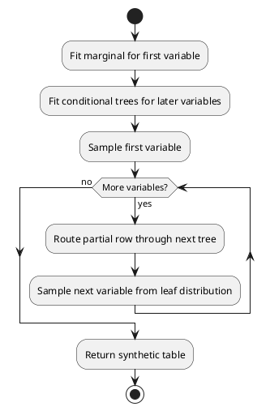

# Diagrams

SeqTree keeps PlantUML source files in `docs/diagrams/` so architecture and
workflow diagrams can be rendered by documentation tooling or external PlantUML
services.

## PlantUML Sources

- [Sequential synthesis](diagrams/sequential_synthesis.puml)
- [Class overview](diagrams/class_overview.puml)

## Sequential Synthesis Preview

